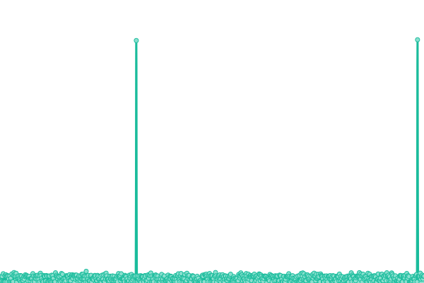
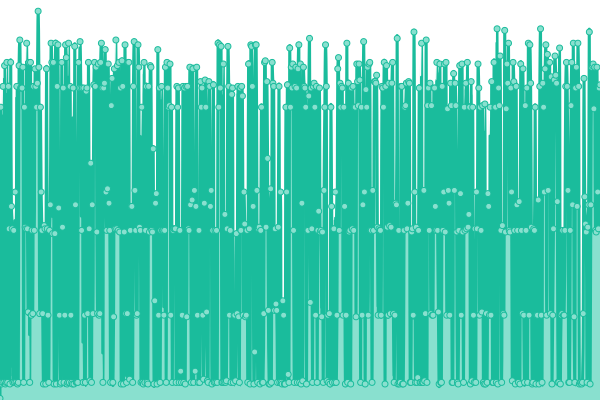
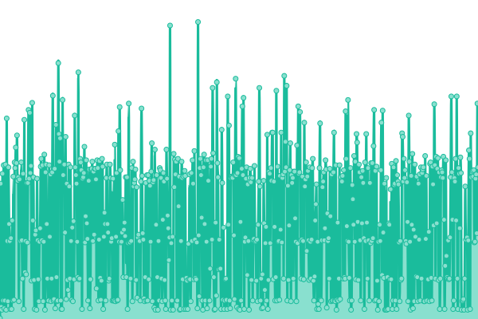
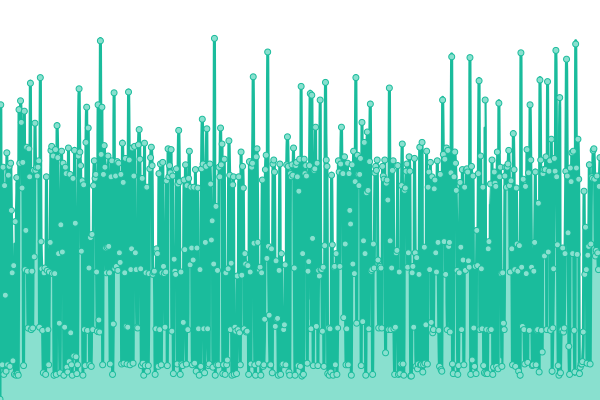
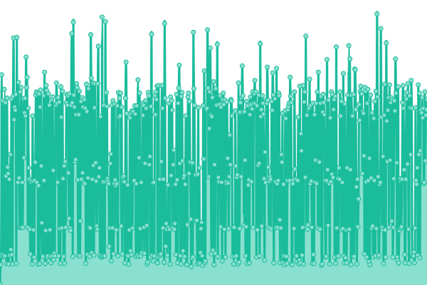
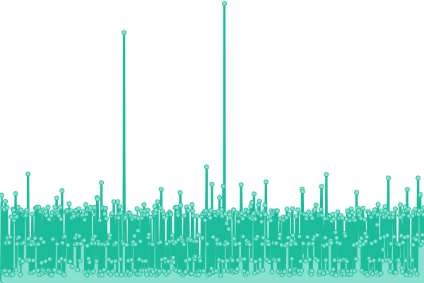
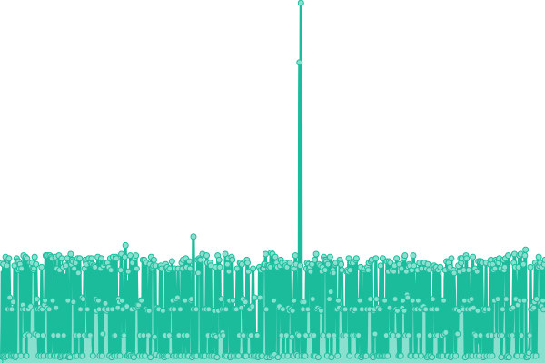
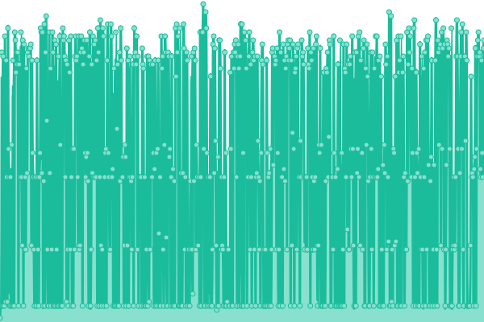
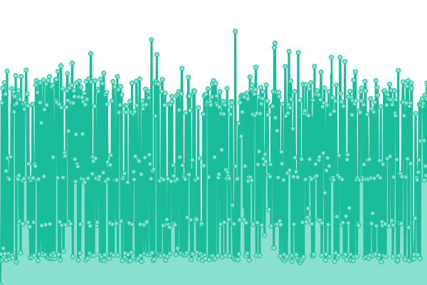

# [📈 Live Status](https://ocf.github.io/ocfuptime): <!--live status--> **🟩 All systems operational**

This repository contains the open-source uptime monitor and status page for [Open Computing Facility](https://ocf.berkeley.edu), powered by [Upptime](https://github.com/upptime/upptime).

With [Upptime](https://upptime.js.org), you can get your own unlimited and free uptime monitor and status page, powered entirely by a GitHub repository. We use [Issues](https://github.com/ocf/ocfuptime/issues) as incident reports, [Actions](https://github.com/ocf/ocfuptime/actions) as uptime monitors, and [Pages](https://ocf.github.io/ocfuptime) for the status page.

<!--start: status pages-->
<!-- This summary is generated by Upptime (https://github.com/upptime/upptime) -->
<!-- Do not edit this manually, your changes will be overwritten -->
<!-- prettier-ignore -->
| URL | Status | History | Response Time | Uptime |
| --- | ------ | ------- | ------------- | ------ |
|  [OCF](https://www.ocf.berkeley.edu) | 🟩 Up | [ocf.yml](https://github.com/ocf/ocfuptime/commits/HEAD/history/ocf.yml) | 

 279ms
     
 | 

<a href="https://ocf.github.io/ocfuptime/history/ocf">100.00%</a>
    

|  [ocf.io](https://ocf.io) | 🟩 Up | [ocf-io.yml](https://github.com/ocf/ocfuptime/commits/HEAD/history/ocf-io.yml) | 

 355ms
     
 | 

<a href="https://ocf.github.io/ocfuptime/history/ocf-io">100.00%</a>
    

|  [New OCF](https://new.ocf.berkeley.edu) | 🟩 Up | [new-ocf.yml](https://github.com/ocf/ocfuptime/commits/HEAD/history/new-ocf.yml) | 

 306ms
     
 | 

<a href="https://ocf.github.io/ocfuptime/history/new-ocf">100.00%</a>
    

|  [OCF TheLounge](https://irc.ocf.berkeley.edu) | 🟩 Up | [ocf-the-lounge.yml](https://github.com/ocf/ocfuptime/commits/HEAD/history/ocf-the-lounge.yml) | 

 216ms
     
 | 

<a href="https://ocf.github.io/ocfuptime/history/ocf-the-lounge">100.00%</a>
    

|  [OCF Chat](https://chat.ocf.berkeley.edu) | 🟩 Up | [ocf-chat.yml](https://github.com/ocf/ocfuptime/commits/HEAD/history/ocf-chat.yml) | 

 244ms
     
 | 

<a href="https://ocf.github.io/ocfuptime/history/ocf-chat">100.00%</a>
    

|  [OCF Matrix](https://matrix.ocf.berkeley.edu) | 🟩 Up | [ocf-matrix.yml](https://github.com/ocf/ocfuptime/commits/HEAD/history/ocf-matrix.yml) | 

 350ms
     
 | 

<a href="https://ocf.github.io/ocfuptime/history/ocf-matrix">100.00%</a>
    

|  [OCF Mirrors](https://mirrors.ocf.berkeley.edu) | 🟩 Up | [ocf-mirrors.yml](https://github.com/ocf/ocfuptime/commits/HEAD/history/ocf-mirrors.yml) | 

 206ms
     
 | 

<a href="https://ocf.github.io/ocfuptime/history/ocf-mirrors">100.00%</a>
    

|  [OCF Mirrors (HTTP)](http://mirrors.ocf.berkeley.edu) | 🟩 Up | [ocf-mirrors-http.yml](https://github.com/ocf/ocfuptime/commits/HEAD/history/ocf-mirrors-http.yml) | 

 123ms
     
 | 

<a href="https://ocf.github.io/ocfuptime/history/ocf-mirrors-http">100.00%</a>
    

|  [OCF APT Repository](http://apt.ocf.berkeley.edu) | 🟩 Up | [ocf-apt-repository.yml](https://github.com/ocf/ocfuptime/commits/HEAD/history/ocf-apt-repository.yml) | 

 140ms
     
 | 

<a href="https://ocf.github.io/ocfuptime/history/ocf-apt-repository">100.00%</a>
    

|  [OCF APT Repository (HTTPS)](https://apt.ocf.berkeley.edu) | 🟩 Up | [ocf-apt-repository-https.yml](https://github.com/ocf/ocfuptime/commits/HEAD/history/ocf-apt-repository-https.yml) | 

 135ms
     
 | 

<a href="https://ocf.github.io/ocfuptime/history/ocf-apt-repository-https">100.00%</a>
    

|  [OCF WebSSH](https://ssh.ocf.berkeley.edu) | 🟩 Up | [ocf-web-ssh.yml](https://github.com/ocf/ocfuptime/commits/HEAD/history/ocf-web-ssh.yml) | 

 197ms
     
 | 

<a href="https://ocf.github.io/ocfuptime/history/ocf-web-ssh">97.83%</a>
    

|  [OCF HedgeDoc](https://notes.ocf.berkeley.edu) | 🟩 Up | [ocf-hedge-doc.yml](https://github.com/ocf/ocfuptime/commits/HEAD/history/ocf-hedge-doc.yml) | 

 282ms
     
 | 

<a href="https://ocf.github.io/ocfuptime/history/ocf-hedge-doc">100.00%</a>
    

|  [OCF Auth](https://auth.ocf.berkeley.edu) | 🟩 Up | [ocf-auth.yml](https://github.com/ocf/ocfuptime/commits/HEAD/history/ocf-auth.yml) | 

 200ms
     
 | 

<a href="https://ocf.github.io/ocfuptime/history/ocf-auth">100.00%</a>
    

|  [OCF Jukebox](https://jukebox.ocf.berkeley.edu) | 🟩 Up | [ocf-jukebox.yml](https://github.com/ocf/ocfuptime/commits/HEAD/history/ocf-jukebox.yml) | 

 225ms
     
 | 

<a href="https://ocf.github.io/ocfuptime/history/ocf-jukebox">100.00%</a>
    

|  [OCF API](https://api.ocf.berkeley.edu) | 🟩 Up | [ocf-api.yml](https://github.com/ocf/ocfuptime/commits/HEAD/history/ocf-api.yml) | 

 203ms
     
 | 

<a href="https://ocf.github.io/ocfuptime/history/ocf-api">100.00%</a>
    

|  [OCF Grafana](https://grafana.ocf.berkeley.edu) | 🟩 Up | [ocf-grafana.yml](https://github.com/ocf/ocfuptime/commits/HEAD/history/ocf-grafana.yml) | 

 339ms
     
 | 

<a href="https://ocf.github.io/ocfuptime/history/ocf-grafana">100.00%</a>
    

|  [tsunami SSH](ssh.ocf.berkeley.edu) | 🟩 Up | [tsunami-ssh.yml](https://github.com/ocf/ocfuptime/commits/HEAD/history/tsunami-ssh.yml) | 

 42ms
     
 | 

<a href="https://ocf.github.io/ocfuptime/history/tsunami-ssh">100.00%</a>
    

|  [OCF Mirrors rsync](mirrors.ocf.berkeley.edu) | 🟩 Up | [ocf-mirrors-rsync.yml](https://github.com/ocf/ocfuptime/commits/HEAD/history/ocf-mirrors-rsync.yml) | 

 41ms
     
 | 

<a href="https://ocf.github.io/ocfuptime/history/ocf-mirrors-rsync">100.00%</a>
    

|  [OCF Jenkins](https://jenkins.ocf.berkeley.edu) | 🟩 Up | [ocf-jenkins.yml](https://github.com/ocf/ocfuptime/commits/HEAD/history/ocf-jenkins.yml) | 

 306ms
     
 | 

<a href="https://ocf.github.io/ocfuptime/history/ocf-jenkins">50.44%</a>
    

<!--end: status pages-->

[**Visit our status website →**](https://ocf.github.io/ocfuptime)

## 📄 License

- Powered by: [Upptime](https://github.com/upptime/upptime)
- Code: [MIT](./LICENSE) © [Open Computing Facility](https://ocf.berkeley.edu)
- Data in the `./history` directory: [Open Database License](https://opendatacommons.org/licenses/odbl/1-0/)
